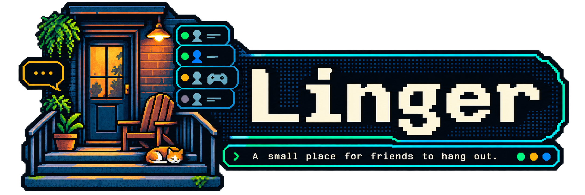

<div align="center">

</div>

# Linger

**A small, self-hosted place for a group of friends to hang out.**

Text rooms, presence, and file sharing. One person runs a server and their friends
install a client and connect to it. Not federated. Not a platform. No company in the
middle.

> To linger is to stay somewhere with no agenda and no obligation to be doing
> anything. That is the product thesis in one word.

**Status: pre-alpha, under active construction.** See [SPEC.md](SPEC.md) for the full
product specification.

---

## 🧭 Why this exists

The big chat platforms are built for a stadium of fifty thousand strangers. Linger is
built for a dinner party of eight. Every feature decision resolves against three
principles, in order:

1. **Presence over messages.** The app should feel alive when nobody is typing.
2. **Remove obligation.** No counters, no streaks, no red dots, no "you're behind."
3. **Keep the artifact.** Photos, clips, links, and jokes don't scroll away into nothing.

## 🏠 The case for running your own

There was a stretch of the internet where a group of friends just *had* a place. Somebody
ran it. You knew who that was, you could ask them for things, and the whole arrangement
was a few files on a machine somebody owned. Then everyone moved into one enormous
building owned by a company, and the terms changed:

- **Your conversations sit on someone else's disk, and the company's business depends on
  what it can learn from them.** You are not the customer.
- **Features get held back and sold back to you.** The free experience gets a little
  worse on purpose, because friction is what makes an upsell work. That is not a bug in
  the design... it *is* the design.
- **There's a storefront in the middle of your conversation**, selling cosmetics and
  subscriptions nobody asked for.
- **The product changes under you** whenever a growth target does, and nobody asks.

Linger is the other arrangement. One person runs a server for their friends. The whole
thing is one binary, one SQLite file, and a folder of uploads — you can back it up, move
it to another box, read it with off-the-shelf tools, or walk away with all of it. There
is no account that spans servers, no directory, no company in the middle.

And there is nothing to sell you, structurally: no paid tier, no store, no cosmetics, no
premium anything, and none of it held back for later. It's AGPL-3.0, so if someone runs a
modified server for other people, those people get the source. **Zero telemetry** — not
opt-in, not anonymous, not crash reports.

This is not an attempt to build a better platform. It's an attempt to not need one.

## 🗣️ Vocabulary

These terms are used everywhere — UI, code, docs, error messages:

| Concept | Term |
|---|---|
| An instance | **a server** |
| A text channel | **a room** |
| Being present in a room | **in the room** |
| The person running it | **the host** |
| Media/link archive | **media** |
| A user's status card | **their status** |

## ✨ What it does (V1)

- 🪑 **Rooms you're in** — focusing a room means you're in it; others see
  occupancy, and each person has a personal **entrance sound** that plays on arrival
- 👥 **A roster-forward layout** — people are the primary surface, not a gutter; each
  friend is a card showing presence, room, activity, and their status
- 🔕 **No unread counts** — a "you left off here" line and a subtle label-weight change,
  never a badge; direct person-to-person mentions are the only real notification
- 🎮 **Ambient activity** — opt-in, default-off sharing of the app you're using,
  resolved against a bundled registry; **window titles are never read or transmitted**
- ✍️ **Styled names** (the AIM feature) — curated fonts, a named 16-color palette,
  gradients, shimmer/glow; and **statuses** with away messages
- 🗄️ **Media** — everything ever shared, browsable and filterable; star things to
  keep them forever
- 📝 **Text that stays text** — a small markdown subset (bold, italic, strikethrough,
  code, quotes, lists, links), plus edit, delete and reply. Message bodies are parsed
  into a tree and drawn as elements; **no raw HTML from a message, ever**
- 🎚️ **Reactions by weight** — a fixed palette of 12; six identical reactions render
  denser and larger, not "👍 6"
- 📁 **File sharing** — 500 MB files, resumable uploads, **EXIF always stripped**
- 🖥️ **Desktop client** for Linux, Windows, and macOS (Tauri 2, not Electron)
- 📦 **Full export** — any member can export all messages and media, any time, no
  gatekeeping

## 🚫 What it will never have

XP, levels, streaks, or engagement metrics. Federation. A bot marketplace. A
role/permission matrix. Threads. `@everyone`. Algorithmic ordering. Unread badges.
**Telemetry or analytics of any kind.** A paid tier, a store, or anything else to sell
you.

The scope discipline is the product.

## 🔐 Privacy and the threat model

Stated plainly:

> Messages and files are encrypted in transit (TLS) and at rest on the host's disk.
> **The person running the server can read everything on it.** There is no
> end-to-end encryption. Run your own server, or trust the person who runs the one
> you're on. If you need cryptographic guarantees against your host, use Signal.

Other privacy properties that *are* guaranteed:

- Activity sharing is **default off**, resolves only against a bundled app registry,
  and **never reports window titles** — the type system has no field for them
- Browsers report as the browser ("Firefox"), never the site or tab
- EXIF (including GPS) is stripped from every uploaded image, no toggle
- Zero telemetry, zero crash reporting, zero phone-home — not even opt-in

## 🤖 The AI stance

**None. No AI features anywhere in Linger.** No participants, no suggested replies, no
drafting, no sentiment analysis, no summaries, no semantic search, no transcription, and
no model endpoint — not even a local one.

An earlier draft of the spec planned a set of local-only, opt-in features for after V1
shipped. That's cut. Standing up a model alongside a chat app for eight friends is a real
cost pushed onto whoever is hosting, for something nobody asked for — and a "local only"
promise is one bad afternoon away from becoming an API key and your friends' messages
leaving the box. Not having the feature is the only version of that promise that can't
rot.

There's also a simpler reason. The value of a friend replying is that a person chose to
spend attention on you. Put something in the room that also replies and every reply gets
cheaper, because you can no longer tell what was chosen.

If it's ever revisited it'll be a deliberate decision, written down in
[SPEC.md §8](SPEC.md) with the reasoning, not a thing that quietly appears in a release.

## 🚀 Running a server

Target: a working server in under 15 minutes. One binary plus one data directory, or:

```bash
cd deploy
# edit compose.yaml: set LINGER_DOMAIN to your domain
docker compose up -d
docker compose logs linger   # prints a one-time host-setup URL on first run
```

Caddy is bundled so TLS certificates are automatic.

The setup URL in that log is meant for the desktop client, not a browser: open Linger
and paste it into the first box. It creates your account, makes you the host, and names
the server. It works once, and a restart replaces it.

Inviting people works the same way. An invite code becomes a link by hanging it off
your server's address — `https://linger.example/invite/CODE` — and whoever you send it
to pastes that into the same box. The box also takes a bare address
(`linger.example`) for signing back in.

**Backup** is the whole point of self-hosting your friendships — it's two paths:
`data/linger.db` and `data/objects/`. A cron one-liner:

```bash
sqlite3 data/linger.db ".backup data/backups/linger-$(date +%F).db"
```

## 🛠️ Development

```
crates/linger-core/       shared types, IDs, palette — the wire contract
crates/linger-server/     axum REST + WS gateway, SQLite (WAL), object store
crates/linger-activity/   foreground-app detection, per-OS backends
client/                   Tauri 2 shell + React/TypeScript frontend
registry/apps.json        bundled app registry for activity detection
deploy/                   Dockerfile, compose, Caddyfile
```

Read first, in order: [SPEC.md](SPEC.md) → [ARCHITECTURE.md](ARCHITECTURE.md) →
[PROTOCOL.md](PROTOCOL.md) → [AGENTS.md](AGENTS.md). The docs are the source of truth.

```bash
# server + core + activity (no GUI deps needed)
cargo test --workspace

# frontend
cd client && pnpm install && pnpm check && pnpm test

# desktop client (needs system webview deps; on Debian/Ubuntu:
#   sudo apt install libwebkit2gtk-4.1-dev libgtk-3-dev \
#                    libayatana-appindicator3-dev librsvg2-dev)
cd client && pnpm tauri dev
```

Before you push, run what CI runs — it gates on all of it:

```bash
cargo fmt --all --check
cargo clippy --workspace --all-targets -- -D warnings
cargo test --workspace
cd client && pnpm check && pnpm test && pnpm exec vite build

# the desktop shell — outside the workspace, so it needs its own pass
cd client/src-tauri && cargo clippy --all-targets -- -D warnings && cargo test
```

Things that surprise people the first time:

- **Wire types are generated, not written.** They're defined once in `linger-core` and
  exported to TypeScript by `ts-rs` into `client/src/generated/`. `cargo test -p
  linger-core` regenerates them. The output is committed, and CI fails if it drifts from
  the Rust source — so commit the regenerated files with your change. Never hand-write a
  type that crosses the wire.
- **Renaming a wire type leaves an orphan.** `ts-rs` writes files but never deletes them,
  so the old `.ts` file stays behind and the drift check won't catch it. Delete it by hand.
- **`client/src-tauri` is not in the root cargo workspace.** It links against system
  webview libraries that CI and server boxes don't have. Build it with `pnpm tauri`, not
  `cargo`.
- **pnpm comes from corepack** and the version is pinned in `client/package.json`. Run
  pnpm commands from inside the repo so it picks up the pin.
- **`cargo test --workspace` skips the client shell**, for the same reason. Its tests
  are `cd client/src-tauri && cargo test`, and CI runs them in the `tauri-shell` job.
  A few need a real desktop session (an unlocked keyring, for one) and are marked
  `#[ignore]` — run those with `cargo test -- --ignored` when you're sitting in front
  of the machine.
- **The WebSocket connection is not in the WebView.** It lives in the Tauri core
  (`client/src-tauri/src/gateway.rs`) and sends the frontend two events: a connection
  status and each sequenced server frame. The frontend has one store,
  `client/src/lib/gateway.ts`, and no connection code at all. Reconnecting, resume, and
  sequence accounting are Rust's problem, and they're covered by tests that talk to a
  real socket.
- **The message list is virtualized**, so only the rows on screen exist in the DOM
  (`client/src/stream/`). Two rules follow from that and both are easy to trip over.
  Space between rows must be *padding*, never margin — the virtualizer measures each
  row's own box and a margin sits outside it. And a row's height is a guess until it
  has been drawn once, so anything that scrolls to a position has to keep re-aiming as
  the real heights arrive; jumping once lands in the wrong place.
- **The only thing that interrupts you is somebody naming you.** A mention, or a person
  you ticked in `notify me when`, raises a desktop notification through
  `tauri-plugin-notification`. Nothing else does, and there is no badge for one to hang
  off. On Linux that means a notification service on the session bus — Plasma, GNOME and
  `dunst` all provide one. Without one, or if you turn notifications off at the OS level,
  the message still arrives in the stream; you just don't get interrupted about it.
- **Signing in needs a keyring to be remembered.** The refresh token goes to the OS
  keyring — Keychain, Credential Manager, or a Secret Service provider like
  gnome-keyring or KWallet. Without one, or with `pnpm dev` in a plain browser, the app
  still works; it just says so and asks you to sign in again next launch.

Current work queue lives in [TASKS.md](TASKS.md).

## 🗺️ Roadmap

- **V1** — replaces the text half of a big chat platform for one friend group
  (see [SPEC.md §6](SPEC.md))
- **V2** — voice rooms, ambient voice, DMs, search, knock, mobile
- **V3 or never** — opt-in directory, sandboxed client scripting, custom emoji

There is no AI phase. It was on this list once; it was cut
([SPEC.md §8](SPEC.md)).

## 📜 License

[AGPL-3.0](LICENSE). If you run a modified server for other people, they get the source.
That's the deal.
